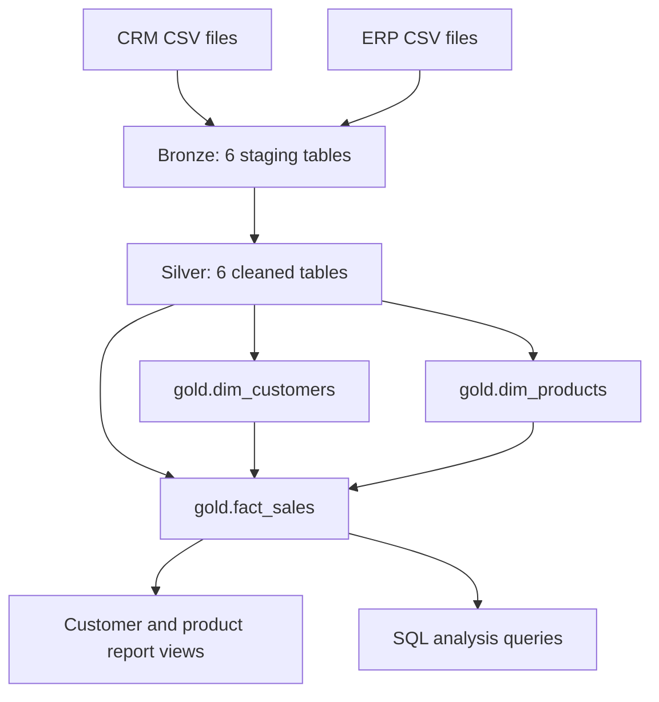

# SQL Data Warehouse and Analytics

A SQL Server portfolio project by **Giat Sudrajat** that integrates CRM and ERP sales data into a layered warehouse and reusable customer and product reports.

The project demonstrates T-SQL data loading, cleansing, dimensional modeling, data quality checks, and business analysis. The warehouse is a full-refresh learning implementation; its Gold model is built from views.

## What is implemented

| Layer | Objects | Responsibility |
| --- | --- | --- |
| Bronze | 6 tables; `bronze.load_bronze` | Import source CSV rows into typed staging tables |
| Silver | 6 tables; `silver.load_silver` | Deduplicate customers, standardize attributes, and clean dates and sales measures |
| Gold model | `gold.dim_customers`, `gold.dim_products`, `gold.fact_sales` | Integrate sources into a logical star schema |
| Gold reports | `gold.report_customer`, `gold.report_products` | Customer segmentation and product performance metrics |
| Analytics | 11 analysis scripts | Exploration, trends, cumulative totals, rankings, segmentation, and contribution analysis |

**Project stack:** SQL Server 2022+, T-SQL, and Git. Use a SQL client that supports SQL Server script execution and `GO` batch separators.

## Architecture



The dimension links are query joins, not enforced foreign keys. [Architecture and design decisions](docs/architecture.md) explain key generation, refresh behavior, and the current-product model.

## Quick start

1. Connect to **SQL Server 2022 or later**. Some analytics use `DATETRUNC`.
2. Clone this repository and prepare the six raw CRM/ERP files using [Source data](docs/source_data.md).
3. Make the files readable by SQL Server at `/var/opt/mssql/datasets/`, or edit the six server-side paths in the Bronze loader.
4. Follow the ordered deployment and loading steps in [Setup](docs/setup.md).
5. Run the [quality checks](docs/data_quality.md), create both report views, and explore [Analytics](docs/analytics.md).

**Reset behavior:** `scripts/init_database.sql` drops and recreates `DataWarehouse`. Use a disposable development database and review the script before running it.

The committed [flat files](datasets/flat_files/) are Gold-shaped reference data. They are **not** the raw CSV inputs expected by the Bronze loader. The source-data guide contains version-pinned download commands for those inputs.

After setup:

```sql
USE DataWarehouse;
GO

SELECT TOP (10) *
FROM gold.report_customer
ORDER BY total_sales DESC, customer_key;

SELECT TOP (10) *
FROM gold.report_products
ORDER BY total_sales DESC, product_key;
```

## Repository guide

| Path | Contents |
| --- | --- |
| [datasets/flat_files/](datasets/flat_files/) | Customer, product, and sales reference CSVs |
| [docs/](docs/) | Setup, source data, architecture, catalog, analytics, and quality guidance |
| [scripts/init_database.sql](scripts/init_database.sql) | Destructive development database reset and schema creation |
| [scripts/bronze/](scripts/bronze/) | Bronze table definitions and load procedure |
| [scripts/silver/](scripts/silver/) | Silver table definitions and transformation procedure |
| [scripts/gold/](scripts/gold/) | Three core Gold views |
| [scripts/analytics/](scripts/analytics/) | Two report definitions and eleven analytical scripts |
| [tests/](tests/) | Diagnostic checks and SQL Server regression fixtures |
| [.github/workflows/sql-regression.yml](.github/workflows/sql-regression.yml) | Regression workflow using an isolated SQL Server container |

## Documentation

- [Setup and troubleshooting](docs/setup.md)
- [Dataset provenance, file mapping, and downloads](docs/source_data.md)
- [Architecture and transformation rules](docs/architecture.md)
- [Gold data catalog](docs/data_catalog.md)
- [Analytics and metric definitions](docs/analytics.md)
- [Data quality and regression testing](docs/data_quality.md)

## Scope and limitations

- Bronze and Silver reload with `TRUNCATE` and `INSERT`; there is no incremental ingestion or scheduler.
- Gold objects are views. `ROW_NUMBER()` keys may change when the underlying data changes and must not be treated as durable external identifiers.
- Gold uses current product attributes; historical product versions in Silver are not matched to sales dates.
- Unmatched dimension joins retain sales with NULL keys. Reports aggregate these into an unknown-key group rather than recovering individual missing identities.
- Report metrics exclude rows without a valid order date. Some exploration queries include all sales, so their totals can differ.
- Source monetary columns use whole-number `INT` values. Report averages use decimal arithmetic; the project does not define currency conversion or fractional source-price support.
- Loader errors are rethrown to callers. Multi-table refreshes are not atomic, so a failed load must be investigated and rerun before publishing results.
- The regression workflow validates synthetic cases. Full-dataset quality results and performance benchmarks require a run against the chosen dataset and SQL Server environment.

## Learning reference and attribution

The learning reference and raw CRM/ERP dataset are from [Data with Baraa's SQL Data Warehouse Project](https://github.com/DataWithBaraa/sql-data-warehouse-project). The source version and its MIT notice are recorded in [Source data](docs/source_data.md).

This repository develops the SQL implementation, analytics, and documentation as part of my Data Engineering learning portfolio.

## About the author

I'm **Giat Sudrajat**, an aspiring Data Engineer building practical skills in SQL, data pipelines, data modeling, and analytics. This project documents both the implementation and the trade-offs behind it.

## License

See [LICENSE](LICENSE) for this repository and the [upstream MIT notice](docs/licenses/data-with-baraa-MIT.txt) for the referenced learning materials and source dataset.
